# 🏗️ Java - Conception et Modélisation (UML)

## 📐 SECTION 1 - LE CYCLE DE DÉVELOPPEMENT (CYCLE EN V)

**Description :** Le cycle en V est un modèle d'organisation qui fait correspondre chaque phase de conception à une phase de test et de validation.

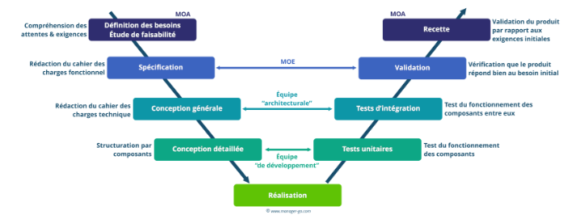

**Points positifs :**

* **Vision globale** : Permet de s'assurer que le produit final répond aux besoins initiaux du client (Maîtrise d'Ouvrage - MOA).

* **Vérification structurée** : Chaque niveau de conception (générale, détaillée) possède son propre niveau de test (intégration, unitaire).

**Exemples :**

* **La Spécification** (MOA) est validée par la **Recette** finale.

* **La Conception détaillée** (MOE) est validée par les **Tests Unitaires** du code.

## 🎭 SECTION 2 - DIAGRAMMES DE CAS D'UTILISATION (USE CASES)

**Description :** Ces diagrammes modélisent **à quoi sert** le système du point de vue de l'utilisateur (l'acteur).


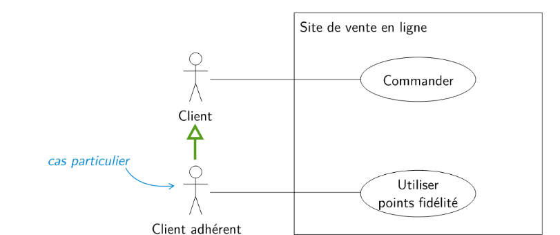

* **Généralisation** : X est un cas particulier de 

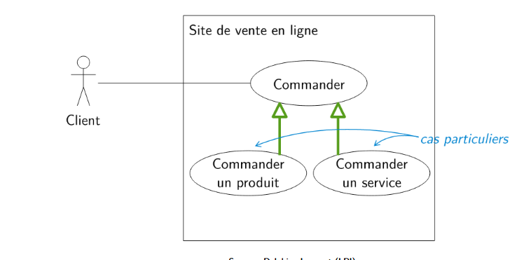

* **Extension** : X étend Y 
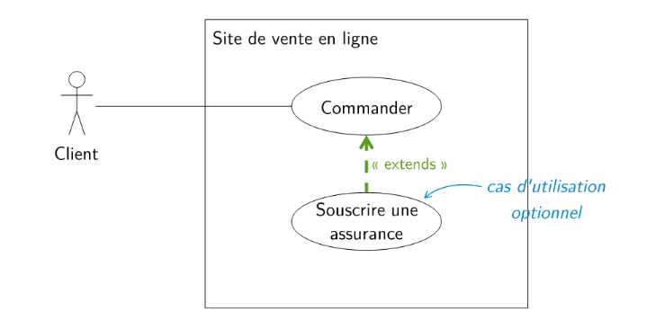

* **Inclusion** : X est un cas particulier de Y

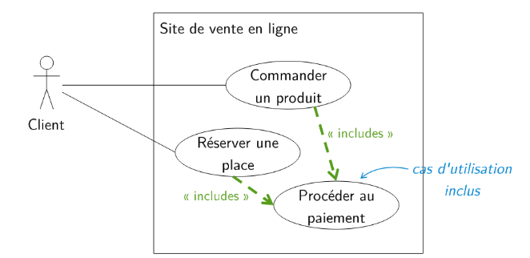

**Points positifs :**
* **Compréhension du besoin** : Idéal pour discuter avec le client sans entrer dans les détails techniques.

* **Définition du cadre** : Permet de définir précisément les limites du système et qui interagit avec lui.

**Relations clés :**

* **`<<include>>`** : Une fonctionnalité qui en déclenche obligatoirement une autre (ex: *Commander* inclut *S'identifier*).

* **`<<extend>>`** : Une fonctionnalité optionnelle (ex: *Souscrire une assurance* étend *Commander*).

Voici des détails supplémentaires pour enrichir la partie sur les **Diagrammes de Séquence**, en suivant la structure pédagogique de votre cours.

---

## ⏳ SECTION 3 - LES DIAGRAMMES DE SÉQUENCE

### 1. Concept et Utilité

**Description :** Alors que le diagramme de classe montre la structure (le "quoi"), le diagramme de séquence décrit **comment** les éléments du système interagissent entre eux et avec les acteurs au fil du temps. C'est une représentation chronologique des échanges de messages.

**Points positifs :**

* **Chronologie claire** : Visualise l'ordre exact des opérations pour réaliser une tâche.

* **Détection d'oublis** : Permet de voir s'il manque des méthodes dans le diagramme de classe pour répondre à un besoin utilisateur.

**Structure du diagramme :**

* **Lignes de vie (Axe vertical)** : Représentent le passage du temps.

* **Objets/Acteurs (Axe horizontal)** : Représentent les entités qui communiquent.

* **Messages (Flèches)** : Représentent les appels de méthodes ou les signaux.

### 2. Les deux niveaux de modélisation

#### A. Le Niveau Analyse 

**Description :** On l'utilise au début du projet pour décrire les scénarios des cas d'utilisation de manière simple, sans se soucier du code Java.

* Les noms des messages correspondent souvent aux noms des cas d'utilisation.
* Le système est souvent vu comme une "boîte noire" unique.

Exemple Mermaid (Niveau Analyse - Commander un produit)  :

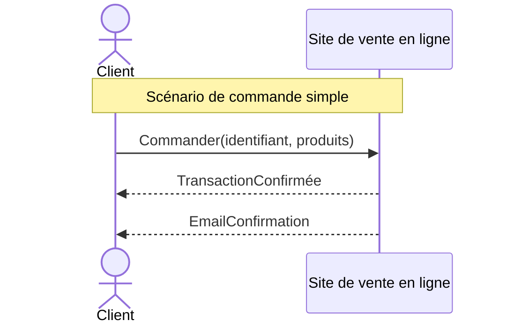
#### B. Le Niveau Scénario/Conception (Messages détaillés)

**Description :** On l'utilise pendant la phase de conception pour illustrer des cas réels avec des valeurs concrètes et des échanges entre objets internes.

* Il met en évidence les relations entre les différents cas (ex: erreur d'identification).
* Il sert de base pour construire des tests complexes.

Exemple Mermaid (Niveau Scénario - Erreur et Inscription)  :

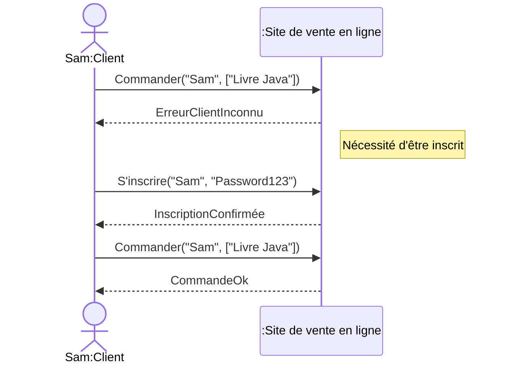

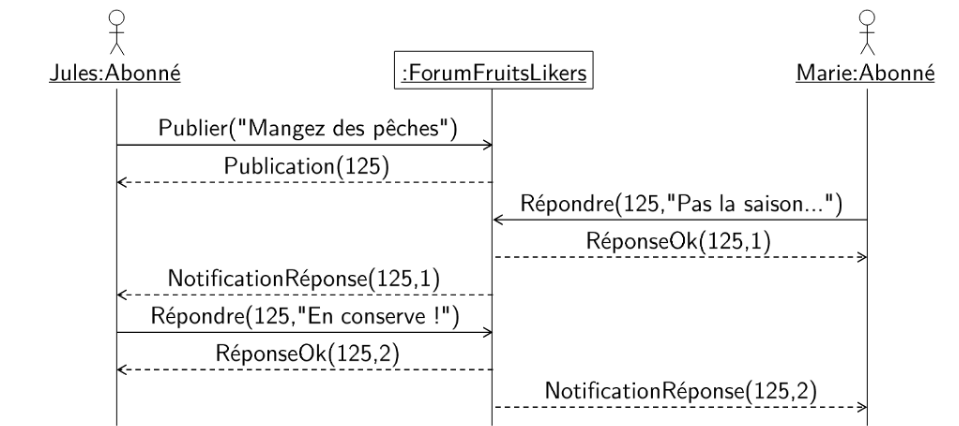

### 3. Éléments graphiques et Recommandations

| Élément | Description UML 
| --- | --- 
| **Acteur** | Bonhomme filaire (entité externe)
| **Ligne de vie** | Trait vertical pointillé sous l'objet
| **Message Synchrone** | Flèche pleine (appel qui attend une réponse)
| **Message Retour** | Flèche pointillée (réponse à un appel)

## ⛓️ SECTION 3 - DIAGRAMMES DE CLASSE (STRUCTURE STATIQUE)

**Description :** C'est la modélisation interne et statique du système. Elle définit les classes, leurs attributs, leurs méthodes et leurs relations.

```Mermaid
classDiagram
A --> B
C --|> D
E --* F
G -- H
I ..|> J
```

* **A-B** : A dépend de B (paramètre, appel de méthode, variable locale, etc.)
* **C-D** : Héritage (classes)
* **E-F** : Composition (possède) > Si E est détruit, F l’est aussi
* **G-H** : Association
* **I-J** : Implémentation (interface)

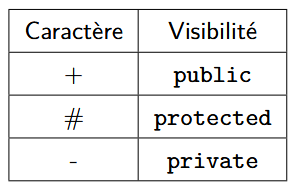

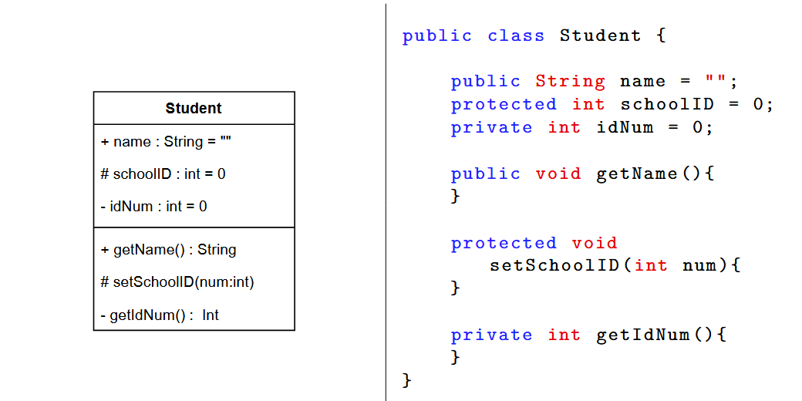

**Association N-Air**:
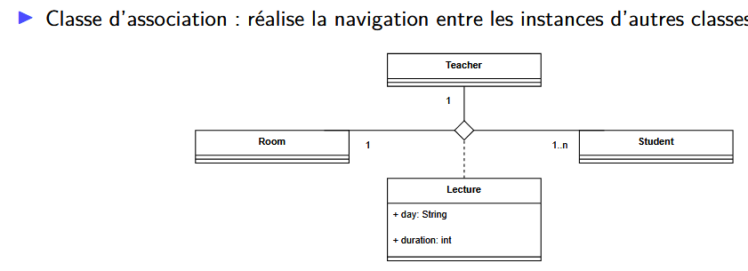

**Classe Association**:
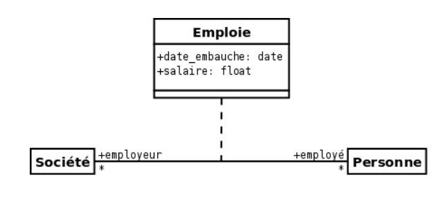

**Représentation :**
Voici un exemple illustrant les relations d'héritage, d'association et d'interface.

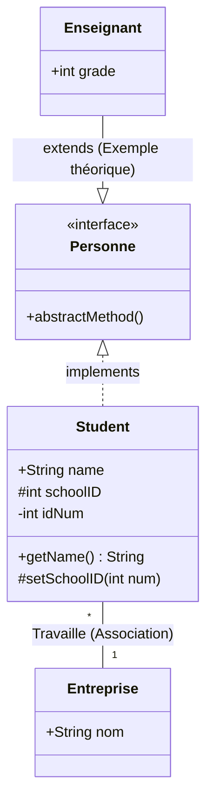

## 🔄 SECTION 5 - DIAGRAMMES D'ÉTATS-TRANSITIONS

**Description :** Ils décrivent le comportement dynamique d'un **seul objet** à l'aide d'un automate à états finis.

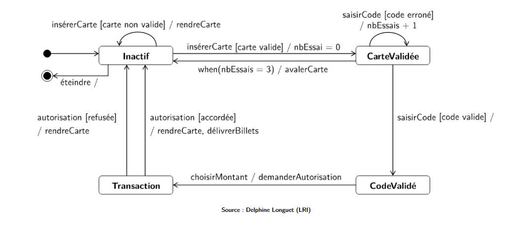

**Points positifs :**

* **Maîtrise de la logique** : Permet de visualiser toutes les réactions possibles d'un objet face à des événements (signaux, temps, appels).

* **Gestion de l'historique** : L'état futur dépend de l'état actuel et de l'événement reçu.

**Exemple d'un Distributeur (GAB) :**

* **États** : *Inactif*, *Carte Validée*, *Code Validé*, *Transaction*.

* **Transitions** : `insérerCarte [carte valide] / nbEssais = 0`.

* **Événements Internes** : `Entry / nbEssais = 0` (action déclenchée dès l'entrée dans l'état).