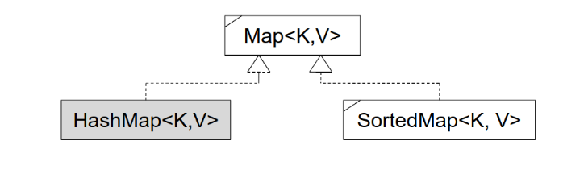
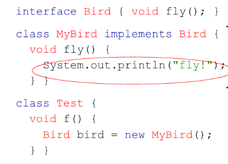
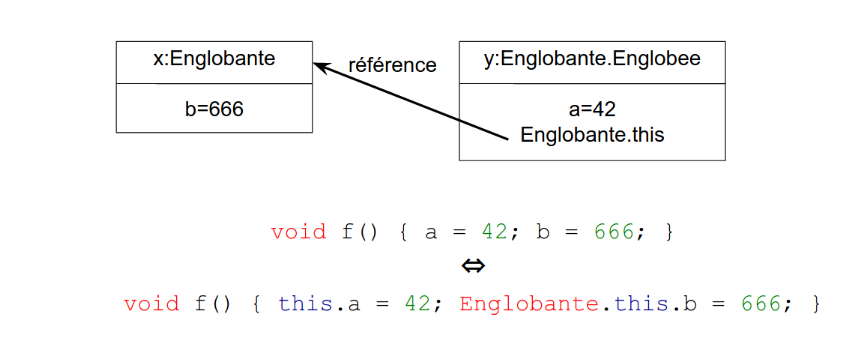
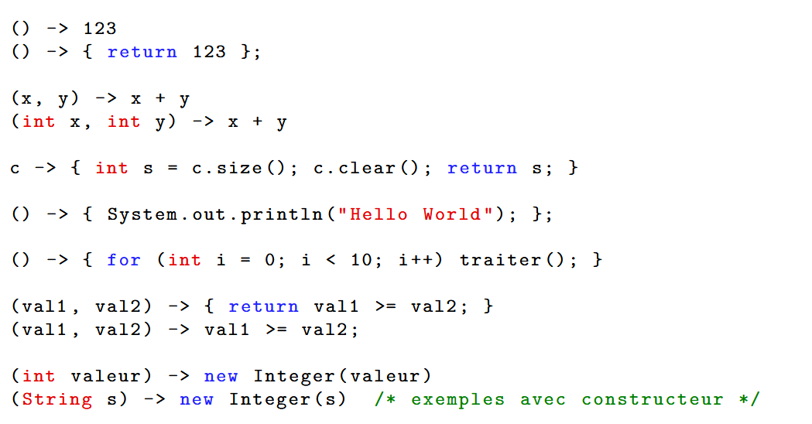

# ☕ Java & Programmation Orientée Objet (POO)

Ce guide couvre les concepts fondamentaux de la POO, l'environnement d'exécution Java et la syntaxe de base (variables, types, structures de contrôle).

---

## 🧺 SECTION 1 - LES TABLEAUX EN JAVA

### 1. Concept et Déclaration

**Description :** Comme en C, un tableau est une structure de données contenant plusieurs éléments du même type. Cependant, en Java, on ne déclare pas une "variable tableau" mais une **variable de type référence** vers un tableau.

**Points positifs :**

**Sécurité :** Java vérifie les bornes ; un accès hors limites provoque une erreur (`ArrayOutOfBoundsException`) plutôt que de corrompre la mémoire.


**Simplicité :** La taille est directement accessible via l'attribut `.length`.

**Exemples :**

```java
int[] tab;               // 1. Déclaration d'une référence 
tab = new int[6];        // 2. Allocation de 6 entiers (initialisés à 0) 
int[] tab2 = {1, 2, 3};  // 3. Déclaration, allocation et initialisation groupées 

```

## 🏗️ SECTION 2 - OBJETS ET CLASSES (LES TUPLES)

### 1. La Classe : Le "Moule"

**Description :** Une classe est un type complexe qui sert de modèle pour créer des objets ; elle regroupe des **attributs** (données) et des **méthodes** (traitements).

**Points positifs :**

**Hétérogénéité :** Contrairement au tableau, un objet peut regrouper des types différents (int, String, etc.).

**Sémantique :** On accède aux données par un **nom de symbole** (ex: `p.pointsVie`) plutôt que par un indice numérique.

**Exemple :**

```java
class Perso {             // Définition du "moule" 
    int pointsVie;        // Attribut 
    int x, y;             // Attributs de position 
}

// Utilisation
Perso bilbon = new Perso(); // Création d'une instance 
bilbon.pointsVie = 10;      // Accès via le point "." 
```

## 🔗 SECTION 3 - LA RÉALITÉ DES RÉFÉRENCES

### 1. Référence vs Objet

**Description :** En Java, **on ne manipule que des références** vers des structures de données en mémoire. La référence contient l'adresse de l'objet, comme un pointeur en C, mais sans permettre d'arithmétique (on ne peut pas l'incrémenter).

**Points positifs :**

**Légèreté :** Passer un gros objet à une fonction ne coûte rien, car on ne copie que sa petite référence (adresse).


**Valeur `null` :** Permet d'indiquer explicitement qu'une variable ne pointe vers aucun objet.

**Exemple d'Aliasing (Partage de référence) :**

```java
byte[] tab1 = new byte[6];
byte[] tab2 = tab1;       // tab2 pointe vers le MÊME tableau que tab1 
tab2[0] = 2;              // Modifier tab2 modifie aussi tab1[0] ! 

```

## 📦 SECTION 4 - LES PACKAGES (L'API JAVA)

### 1. Organisation et Importation

**Description :** Les packages sont des regroupements de classes permettant d'organiser le code et d'utiliser les milliers de classes déjà fournies par Java SE (API).

**Points positifs :**

**Évite les collisions :** Deux classes peuvent avoir le même nom si elles sont dans des packages différents.

**Standardisation :** Accès à des outils puissants (graphisme avec `java.awt`, utilitaires avec `java.util`).

**Exemples :**

```java
import java.util.Date;    // Importe une classe spécifique 
import java.util.*;       // Importe tout le package utilitaire 

// Création d'un package personnel (doit correspondre au dossier ensiie/ipoo/)
package ensiie.ipoo;      // 

```

Ce troisième module est le cœur de la logique comportementale en Java. Nous allons explorer comment les méthodes permettent de donner vie à vos objets et comment protéger vos données grâce à l'encapsulation.

---

# 🛠️ Java - Les Différents Types de Méthodes

Ce cours détaille le fonctionnement des méthodes, la gestion des paramètres (valeur vs référence) et les mécanismes avancés comme la surcharge, les constructeurs et la visibilité.

## 🏗️ SECTION 1 - LES MÉTHODES DE CLASSE (`static`)

### 1. Concept et Utilité

**Description :** Une méthode de classe est un regroupement d'instructions marqué par le mot-clé `static` qui appartient à la classe elle-même et non à une instance spécifique. Elle permet de réutiliser du code sans avoir à créer d'objet.

**Points positifs :**

**Accessibilité :** Utilisable directement via le nom de la classe (ex: `Math.sqrt()`).

**Économie de mémoire :** Pas besoin d'allouer un objet pour exécuter une fonctionnalité utilitaire.

**Exemple :**

```java
public class Calcul {
    // Une méthode de classe pour additionner deux entiers
    static int add(int x, int y) { 
        return x + y; 
    }
}

```

> 
> **Note :** La méthode `main` est la méthode de classe la plus célèbre ; elle est le point d'entrée unique de tout programme Java.
> 
> 

## 🧬 SECTION 2 - LA SURCHARGE (OVERLOADING)

### 1. Définition

**Description :** Java permet de définir plusieurs méthodes avec le même nom au sein d'une classe, à condition que leurs paramètres (nombre ou types) soient différents.

**Points positifs :**

**Clarté :** Permet d'utiliser un seul nom logique pour une même action appliquée à différents types de données.

**Flexibilité :** Le compilateur choisit automatiquement la bonne version en fonction des arguments fournis.

**Exemples :**

```java
static void afficher(int x) { ... }    // Version pour entier 
static void afficher(double x) { ... } // Version pour réel 

afficher(42);   // Appelle la version int 
afficher(3.14); // Appelle la version double

```

## 🔄 SECTION 3 - PASSAGE DES PARAMÈTRES

### 1. Par Valeur (Types Primitifs)

**Description :** Pour les 8 types primitifs (`int`, `double`, `boolean`, etc.), Java envoie une **copie** de la valeur à la méthode.

**Impact :** L'original chez l'appelant n'est **jamais** modifié par l'appelé.

### 2. Par Référence (Objets et Tableaux)

**Description :** Pour les objets, tableaux et `String`, Java envoie une référence vers l'emplacement mémoire original.

**Impact :** Les modifications sur le contenu (ex: `tab[0] = 42`) sont visibles partout car la structure est partagée.


**Le Piège :** La référence elle-même est passée par valeur. Si vous réallouez le paramètre (`t = new int[3]`), vous perdez le lien avec l'original.

## 🧙 SECTION 4 - MÉTHODES D'INSTANCE ET `this`

### 1. Le lien avec l'Objet

**Description :** Une méthode d'instance (sans `static`) est une fonctionnalité associée à une instance spécifique. Elle reçoit un paramètre caché nommé `this` qui représente l'objet actuel.

**Points positifs :**

**Cohésion :** Regroupe les données et les comportements au même endroit.

**Lisibilité :** Syntaxe `objet.methode()` plus intuitive.

**Exemple :**

```java
class Monstre {
    int pointsVie;
    void blesser(int degats) { 
        this.pointsVie -= degats; // this lève l'ambiguïté 
    }
}
```

## 🏗️ SECTION 5 - LE CONSTRUCTEUR

### 1. Initialisation Automatique

**Description :** Le constructeur est une méthode spéciale appelée automatiquement lors du `new` pour initialiser l'objet.

**Règles d'or :**

1. Il porte exactement le **même nom** que la classe.

2. Il n'a **aucun type de retour** (même pas `void`).

3. Si vous n'en écrivez pas, Java en crée un vide par défaut.

## 🛡️ SECTION 6 - L'ENCAPSULATION ET VISIBILITÉ

**Description :** C'est l'art de cacher les détails de mise en œuvre pour ne montrer que les fonctionnalités nécessaires.

### Niveaux de visibilité en Java :

| Mot-clé | Visibilité |
| --- | --- |
| `public` | Partout (n'importe quelle classe)
| `protected` | Uniquement dans le même package
| `private` | Uniquement à l'intérieur de la classe

---

# 🧬 Java - Héritage, Polymorphisme et Abstraction

## 🔝 SECTION 1 - LES BASES DE L'HÉRITAGE

### 1. Concept et Mot-clé `extends`

**Description :** L'héritage permet à une classe "fille" de récupérer automatiquement les champs et méthodes d'une classe "mère" pour les réutiliser ou les spécialiser.

**Points positifs :**

**Réutilisabilité :** On factorise le code commun dans la classe mère au lieu de le copier-coller.

**Hiérarchie logique :** Permet de modéliser des relations de type "est un" (ex: une Épée *est un* Objet).

**Exemples :**

**Système de jeu :** Une classe `Item` (poids, rendu) dont héritent `Weapon` et `Potion`.

**Gestion de fichiers :** Une classe `Flux` générique spécialisable en `FluxFichier` ou `FluxReseau`.

**Mathématiques :** Une classe `Matrice` déclinée en `MatriceCarree` ou `MatriceCreuse`.

## 🛠️ SECTION 2 - MÉCANISMES TECHNIQUES : `super` ET CASTING

### 1. Le mot-clé `super`

**Description :** `super` est utilisé par la classe fille pour appeler explicitement un constructeur ou une méthode de la classe mère.

**Points positifs :**

**Intégrité :** Garantit que la partie "mère" de l'objet est correctement initialisée avant d'ajouter les spécificités de la fille.

**Extension de comportement :** Permet d'ajouter du code à une méthode existante sans la remplacer totalement.

### 2. Transtypage (Casting) et `instanceof`

**Upcasting (Automatique) :** Une `Sword` peut toujours être stockée dans une variable de type `Item`.

**Downcasting (Explicite) :** Pour traiter un `Item` comme une `Sword`, il faut forcer le type : `(Sword)item`.

**Sécurité :** L'opérateur `instanceof` permet de vérifier le type réel avant de convertir pour éviter une erreur à l'exécution.

## 🎭 SECTION 3 - LE POLYMORPHISME ET LA REDÉFINITION

### 1. La Redéfinition (`@Override`)

**Description :** Une classe fille peut réécrire le corps d'une méthode héritée pour adapter son comportement.

**Points positifs :**

**Liaison tardive :** Java appelle la méthode de la classe *réelle* de l'objet, même si la variable est déclarée avec le type de la mère.

**Flexibilité :** Un code générique (ex: gérer un sac d'objets) peut faire appel à `render()` sans savoir s'il affiche une épée ou une potion.

---

## 🔒 SECTION 4 - CONTRÔLE DE L'HÉRITAGE : `final` ET `protected`

| Modificateur | Effet sur l'héritage |
| --- | --- |
| `final` (classe) | Interdit de créer des classes filles. 
| `final` (méthode) | Interdit aux classes filles de redéfinir cette méthode. 
| `protected` | Rend l'élément visible pour les classes filles et le package. 

## ☁️ SECTION 5 - ABSTRACTION ET INTERFACES

### 1. Les Classes et Méthodes Abstraites

**Description :** Une classe `abstract` ne peut pas être instanciée (pas de `new`) ; elle sert de modèle incomplet pour ses filles.

**Points positifs :**

**Contrat forcé :** Oblige les classes descendantes à implémenter certaines méthodes (ex: `getWeight()`).

**Cohérence :** Empêche la création d'objets "génériques" qui n'auraient pas de sens (ex: un objet `Weapon` qui n'est ni une épée ni une masse).

### 2. L'Interface

**Description :** Une interface est une généralisation de l'abstraction qui ne définit que des signatures de méthodes, sans aucun champ.

**Points positifs :**

**Héritage multiple :** Une classe peut implémenter plusieurs interfaces (`implements A, B`), palliant la limitation de l'héritage unique en Java.

**Exemple :**

```java
// Une classe Poison qui est à la fois une Arme et une Potion
class Poison implements Weapon, Potion { 
    public int getDamage() { ... }
    public void drink(Player p) { ... }
}
``` 

C'est une étape cruciale de votre apprentissage. En programmation, tout ne se passe pas toujours comme prévu (mauvaise saisie utilisateur, fichier manquant, division par zéro). Les **exceptions** sont le mécanisme élégant de Java pour traiter ces imprévus sans transformer votre code en un labyrinthe de conditions `if/else`.

Voici la structure de ce cinquième module dédiée à la robustesse de vos applications.

---

# ⚠️ Java - La Gestion des Exceptions

Ce module explique comment signaler, propager et intercepter les erreurs de manière propre et structurée.

## 💡 SECTION 1 - LE CONCEPT D'EXCEPTION

**Description :** Une exception est un objet spécial que l'on peut "lever" (signaler une erreur) et "attraper" (traiter l'erreur) pour gérer les cas d'exécution rares ou indésirables.

**Points positifs :**

**Clarté du code :** Sépare le "chemin normal" de l'application de la gestion des erreurs, rendant le code plus lisible et réutilisable.

**Propagation automatique :** L'erreur remonte d'elle-même la chaîne d'appels (de la méthode appelée vers l'appelant) jusqu'à trouver quelqu'un capable de la gérer.

**Exemples globaux :**

**Calcul mathématique :** Lever une exception si on tente de calculer le logarithme d'un nombre négatif.

**Saisie utilisateur :** Intercepter une erreur si l'utilisateur saisit du texte là où un nombre est attendu.

**Accès mémoire :** Gérer automatiquement les accès hors des bornes d'un tableau (`IndexOutOfBoundsException`).

## 🏗️ SECTION 2 - LE MÉCANISME : LEVER ET SIGNALER

### 1. `throw` vs `throws` (Ne pas confondre !)

**`throw` (sans s) :** C'est l'action de lancer l'objet d'exception au moment où l'erreur survient (ex: `throw new NegativeValue();`).

**`throws` (avec s) :** C'est une déclaration dans la signature de la méthode pour prévenir les appelants : "Attention, cette méthode est susceptible de renvoyer telle erreur".

### 2. Créer sa propre exception

**Description :** Pour créer une erreur personnalisée, il suffit de créer une classe qui hérite de la classe `Exception`.

```java
// Définition d'une erreur personnalisée
class NegativeValue extends Exception {
    public NegativeValue(String message) { super(message); } // Optionnel : message d'erreur
}

```

## 🛡️ SECTION 3 - INTERCEPTER : LE BLOC `try / catch / finally`

**Description :** C'est la structure utilisée pour entourer le code "à risque" et définir comment réagir si une erreur survient.

**`try` :** Délimite la zone de code où l'on surveille les exceptions.

**`catch` :** Le filtre qui attrape l'exception et contient le code de secours.

**`finally` (Optionnel) :** Code exécuté **dans tous les cas**, qu'une erreur soit survenue ou non (utile pour fermer un fichier ou une connexion).

**Exemple concret :**

```java
try {
    double res = log(-5); // Cette méthode lève une NegativeValue
} catch (NegativeValue e) {
    System.out.println("Erreur : " + e.getMessage()); // On traite l'erreur ici
} finally {
    System.out.println("Fin du traitement."); // Toujours exécuté
}

```

## 🚩 SECTION 4 - EXCEPTIONS PRÉDÉFINIES À CONNAÎTRE

Java fournit des exceptions prêtes à l'emploi pour les erreurs les plus courantes:

| Exception | Cause de l'erreur |
| --- | --- |
| **`NullPointerException`** | Tentative d'accès à une référence qui vaut `null`. 
| **`IndexOutOfBoundsException`** | Dépassement de la capacité d'un tableau ou d'une String. 
| **`IllegalArgumentException`** | Un argument passé à une méthode est incorrect. 
| **`ClassCastException`** | Échec d'un transtypage (mauvais cast). 


C'est une excellente progression. Après avoir maîtrisé l'héritage, nous abordons la **généricité**. C'est l'outil ultime pour écrire du code réutilisable tout en garantissant une sécurité maximale. En Java, cela permet de créer des "moules" capables de s'adapter à différents types de données sans perdre en précision.

Voici la structure de ce septième module dédiée aux **Classes Génériques**.

---

# 🧬 Java - Les Classes Génériques

## 🛠️ SECTION 1 - LE PROBLÈME : L'HÉRITAGE "TROP LARGE"

### 1. La limite de la classe `Object`

**Description :** Avant les génériques, pour créer une structure réutilisable (comme une liste), on utilisait un tableau de type `Object` puisque toute classe hérite de `Object`.

**Points négatifs :**

**Transtypage obligatoire :** Comme la liste renvoie des `Object`, le développeur doit forcer le type (downcast) explicitement à chaque lecture.

**Risque d'erreurs :** Le compilateur ne peut pas vérifier si vous insérez par erreur un `Poison` dans un sac censé ne contenir que des `Potion`.

**Lisibilité :** Le code devient lourd et confus à cause des nombreux parenthèses de typage.

## 🏗️ SECTION 2 - LA CLASSE GÉNÉRIQUE

**Description :** Une classe générique est une classe paramétrée par une (ou plusieurs) autre(s) classe(s).

**Points positifs :**

**Sécurité :** Détection des incohérences de types dès la compilation.

**Propreté :** Suppression des transtypages explicites, rendant le code plus fluide.

**Exemples :**

**Un sac spécifique :** `ArrayList<Location>` au lieu de `ArrayList` générique.

**Un dictionnaire :** `Tree<String, Integer>` où chaque clé est un texte et chaque valeur un entier.

## ✍️ SECTION 3 - SYNTAXE ET UTILISATION

### 1. Déclaration d'une classe

On utilise des lettres majuscules (souvent `E` pour Element, `T` pour Type) entre chevrons `< >`.

```java
// E est un paramètre de type inconnu ici
class Bag<E> {
    private E[] elements; // Tableau d'éléments de type E 
    public E get(int i) { return elements[i]; } // 
}
```

### 2. Instanciation (L'opérateur Diamant `<>`)

Lors de la création de l'objet, on précise le type réel. Java 7+ permet d'omettre le type à droite de l'affectation si le compilateur peut le déduire.

```java
Bag<Potion> b = new Bag<>(); // Le compilateur déduit "Potion" 
```

## 🎓 SECTION 4 - NOTIONS AVANCÉES

### 1. Les contraintes avec `extends`

**Description :** On peut restreindre les types acceptés par une classe générique en utilisant le mot-clé `extends`.

**Exemple :**
`class Bag<E extends Item>` garantit que tous les éléments du sac possèdent les méthodes de la classe `Item` (comme `getWeight()`).

> 
> **Note :** On utilise `extends` même si le paramètre doit implémenter une **interface**.
> 
> 

### 2. Le piège des tableaux

**Attention :** Il est interdit d'allouer directement un tableau de classes génériques avec l'opérateur diamant.

**Interdit :** `Truc<String>[] t = new Truc<>[10];`.

**Autorisé :** `Truc<String>[] t = new Truc[10];` (On alloue comme si la classe n'était pas générique).

## 📋 RÉCAPITULATIF TECHNIQUE

| Concept | Syntaxe | Usage |
| --- | --- | --- |
| **Classe paramétrée** | `class Nom<T>` | Créer un modèle flexible.
| **Multi-paramètres** | `class Tree<K, V>` | Pour les structures comme les dictionnaires.
| **Contrainte** | `<E extends Classe>` | Limiter aux types possédant certaines méthodes.
| **Déduction** | `new Nom<>()` | Simplifier l'écriture grâce à l'inférence de type.


C'est un plaisir de poursuivre ce cours ! Nous arrivons maintenant à l'une des parties les plus utiles au quotidien pour un développeur Java : **la bibliothèque des Collections**.

Plutôt que de réinventer la roue en créant vos propres structures à chaque fois, Java vous propose une boîte à outils standardisée, performante et générique via le package `java.util`.

---

# 📚 Java - Les Collections (`java.util`)

## 🛠️ SECTION 1 - LES FONDAMENTAUX DE LA COMPARAISON

Avant de stocker des objets, Java doit savoir comment les comparer. Trois méthodes héritées de la classe `Object` ou d'interfaces de base sont essentielles :

* **`equals(Object o)`** : Utilisée pour vérifier si deux objets ont la même valeur.


* **`hashCode()`** : Fournit un identifiant numérique (hachage) pour un objet, crucial pour les performances des tables de hachage.


* **`compareTo(T o)`** (Interface `Comparable`) : Permet de définir un ordre naturel (savoir si un objet est "plus petit" qu'un autre).

## 🧺 SECTION 2 - LA FAMILLE `Collection<E>`

L'interface `Collection<E>` est la racine des structures stockant des éléments simples.

### 1. L'interface `List<E>` (Listes ordonnées)

**Description** : Une liste est une généralisation des tableaux où chaque élément possède un indice.

**Points positifs** : Les doublons sont autorisés et l'ordre d'insertion est préservé.

**Implémentations** :
* **`ArrayList<E>`** : Basée sur un tableau extensible. Accès aléatoire très rapide, mais l'ajout/suppression au milieu est lent.

* **`LinkedList<E>`** : Basée sur une liste chaînée. Ajout/suppression rapides, mais l'accès à un indice précis est lent.

**Quelques méthodes**:
* `void add(int i, E e)`
* `void set(int i, E e)`
* `E get(int i)`
* `E remove(int i)`

### 2. L'interface `Set<E>` (Ensembles)

**Description** : Un ensemble stocke des éléments uniques, sans notion d'indice.

**Points positifs** : Garantit l'absence de doublons.

**Implémentations** :
* **`HashSet<E>`** : Utilise une table de hachage. Très performant mais l'ordre n'est pas garanti.

* **`TreeSet<E>`** : Utilise un arbre binaire (Rouge-Noir). Les éléments sont automatiquement triés.

## 🔄 SECTION 3 - PARCOURIR UNE COLLECTION

Pour traiter chaque élément d'une collection, deux outils sont privilégiés:

### 1. L'Itérateur (`Iterator<E>`)

* **Description** : Un objet qui permet de naviguer dans la collection un élément à la fois.

* **Méthodes clés** : `hasNext()` (y a-t-il un suivant ?) et `next()` (donne le suivant et avance).

### 2. La boucle "For-Each"

**Description** : Un "sucre syntaxique" qui simplifie l'utilisation de l'itérateur.

**Exemple** :

```java
for (Monster m : col) {
    System.out.println(m.name); // Simple et lisible 
}
```

> 
> **Note** : Cette syntaxe fonctionne également pour les tableaux classiques.
> 
> 

## 🗺️ SECTION 4 - LES TABLES D'ASSOCIATION (`Map<K, V>`)

**Description** : Une `Map` n'est pas techniquement une `Collection`, car elle associe une **Clé** (`K`) à une **Valeur** (`V`).



**Fonctionnalités** :
* `put(key, value)` : Ajoute ou modifie une association.

* `get(key)` : Récupère la valeur associée à une clé.

* `boolean remove(K k)` : supprime l’association

**Implémentations** :
* **`HashMap<K, V>`** : Rapide, non triée.

* **`TreeMap<K, V>`** : Triée selon l'ordre des clés.

## 🎓 RÉCAPITULATIF DES CHOIX TECHNIQUES

| Besoin | Structure recommandée |
| --- | --- |
| **Accès rapide par indice** | <br>`ArrayList` 
| **Ajouts fréquents en milieu de liste** | <br>`LinkedList` 
| **Unicité des éléments (non triés)** | <br>`HashSet` 
| **Unicité + Tri automatique** | <br>`TreeSet` 
| **Dictionnaire (Clé -> Valeur)** | <br>`HashMap` ou `TreeMap` 

---

# 🎭 Java - Classes Internes, Anonymes et Expressions Lambda



## 📦 SECTION 1 - LES CLASSES INTERNES (INNER CLASSES)

### 1. Concept et Couplage

**Description :** Une classe interne est une classe définie à l'intérieur d'une autre classe (dite englobante). Elle permet de coupler fortement deux entités car la classe interne a un accès direct aux champs de la classe externe, même s'ils sont privés.



**Points positifs :**

* **Organisation logique** : Si une classe n'est utile qu'à une seule autre, la placer à l'intérieur clarifie la structure du projet.

* **Encapsulation renforcée** : On peut cacher totalement une classe interne du reste du monde tout en la laissant interagir librement avec sa classe englobante.

**Syntaxe d'allocation :**

```java
Englobante externe = new Englobante();
// L'instance interne est liée à une instance externe
Englobante.Englobee interne = externe.new Englobee(); 
```

## 👤 SECTION 2 - LES CLASSES ANONYMES

### 1. L'Héritage Simplifié

**Description :** Une classe anonyme est une classe interne sans nom, définie et instanciée directement au moment de son allocation. Elle est idéale pour implémenter une interface ou hériter d'une classe pour une utilisation unique et courte.

**Points positifs :**
* **Gain de temps** : Évite de créer un nouveau fichier `.java` pour une classe qui ne contient que quelques lignes de code.

* **Concision** : Le code de la mise en œuvre est situé exactement là où l'objet est créé.

**Exemple :**

```java
// On crée un "oiseau" sans définir de classe MyBird séparée
Bird bird = new Bird() { 
    public void fly() { System.out.println("Fly!"); } 
```

## ⚡ SECTION 3 - LES EXPRESSIONS LAMBDA

### 1. L'Essence du Traitement

**Description :** Les expressions lambda permettent de définir le corps d'une méthode de manière extrêmement concise en s'affranchissant de toute la syntaxe de déclaration de classe, à condition d'utiliser une **interface fonctionnelle** (interface avec une seule méthode abstraite).

**Points positifs :**

* **Lisibilité extrême** : Le code se concentre sur le traitement réel (les paramètres et l'action) plutôt que sur la structure obligatoire de Java.

* **Programmation fonctionnelle** : Permet de passer un traitement (une fonction) comme argument à une autre méthode, facilitant l'abstraction.

**Exemples d'utilisations globales :**



* **Parcours de collection** : Utiliser `forEach` pour afficher chaque élément d'une liste.

```java
epees.forEach(epee -> System.out.println(epee));
```

* **Tri personnalisé** : Définir une règle de comparaison directement dans la méthode `sort`.

```java
liste.sort((e1, e2) -> (e1 % 2) - (e2 % 2)); // Trie les pairs en premier
```

* **Logique simple** : Remplacer un calcul complexe par une expression courte.

```java
(int x, int y) -> x + y; // Somme de deux entiers 
```

## 🎓 RÉCAPITULATIF DES PORTÉES (SCOPE)

| Type | Nommé ? | Fichier dédié ? | Lien externe ? |
| --- | --- | --- | --- |
| **Classe Interne** | Oui | Non | Oui (accès total) 
| **Classe Anonyme** | Non | Non | Lecture seule (locales) 
| **Lambda** | Non | Non | Lecture seule (locales) 


Bonjour ! En tant que professeur, je suis ravi de t'aider à mettre au propre ces notes. Ton camarade a bien saisi l'essentiel, mais certains points manquent de rigueur technique ou de compléments nécessaires pour bien comprendre l'enjeu de ces concepts en entreprise.

Voici une version structurée, corrigée et complétée de tes notes, en m'appuyant sur les critères de qualité logicielle (réutilisabilité, extensibilité, maintenance) que nous avons vus précédemment.

---

# 🏗️ 5. Patrons de Conception (Design Patterns)

Les patrons de conception sont des solutions éprouvées à des problèmes récurrents. Ils visent à améliorer la **qualité logicielle**.

## 📐 Principes de Conception Logicielle

### Cohésion et Couplage

Ces deux concepts sont les deux faces d'une même pièce pour assurer la **modularité** du code.

* **Cohésion (Interne) :** Mesure à quel point les responsabilités d'une classe sont liées. Une classe doit avoir une **seule responsabilité** (Single Responsibility).
    * *Objectif :* Forte Cohésion.
* **Couplage (Externe) :** Mesure le degré de dépendance entre deux classes. Si changer la classe A oblige à modifier la classe B, le couplage est fort.
    * *Objectif :* Faible Couplage.

> **Exemple de la machine à café :**
> * **Machine "Tout-en-un" (Moud + Cuit) :** Si le broyeur casse, vous jetez toute la machine. C'est un **fort couplage** entre les fonctions.
> * **Moulin séparé + Machine à café :** Vous pouvez changer de moulin sans changer de cafetière. C'est une **forte cohésion** (chaque machine fait une seule chose) et un **faible couplage**.
> 
> 

## 🧱 Les Principes S.O.L.I.D.

Ces principes sont les fondations d'un code robuste et extensible.

* **S - Single Responsibility (Responsabilité Unique) :** Une classe ne doit avoir qu'une seule raison de changer.
* **O - Open/Closed (Ouvert/Fermé) :** Le code doit être **ouvert à l'extension** (on peut ajouter des fonctions) mais **fermé à la modification** (on ne touche pas au code existant qui fonctionne déjà).

* **L - Liskov Substitution :** Un objet de type "Fille" doit pouvoir remplacer un objet de type "Mère" sans casser le programme.

* **I - Interface Segregation :** Mieux vaut plusieurs petites interfaces spécifiques qu'une seule grosse interface généraliste que les classes ne sauront pas implémenter entièrement.

* **D - Dependency Inversion (Inversion de Dépendance) :** Il faut dépendre des **abstractions** (interfaces ou classes abstraites) et non des **implémentations** concrètes.

> **Exemple pour le "D" (Inversion) :**
> Si votre classe `Ouvrier` a besoin d'un `MarteauEnFerBleu`, elle ne pourra jamais utiliser un `MarteauEnBois`. Si elle a besoin d'un `OutilDePercussion`(Abstraction), vous pouvez lui donner n'importe quel marteau.

## ♻️ La Pratique DRY (Don't Repeat Yourself)

Le but est d'éviter la duplication. Si vous copiez-collez du code, vous dupliquez aussi les bugs et multipliez le travail de maintenance.

* **Solution :** Factoriser le code commun dans des méthodes ou des classes mères.

## 🎨 Introduction aux Design Patterns

Un patron de conception n'est pas un morceau de code à copier-coller, mais un **schéma de pensée** pour résoudre un problème d'architecture.

### 1. Le Singleton (Création)

**Intention :** Garantir qu'une classe n'a qu'une seule instance et offrir un accès global à celle-ci.

**Code (Version Thread-Safe) :**

```java
public class Singleton {
    // L'unique instance, stockée de manière statique
    private static Singleton uniqueInstance;

    // Constructeur PRIVÉ pour empêcher le 'new' extérieur 
    private Singleton() {}

    // Point d'accès global
    public static synchronized Singleton getInstance() {
        if (uniqueInstance == null) {
            uniqueInstance = new Singleton(); // Lazy initialization
        }
        return uniqueInstance;
    }
}
```

### 2. La Factory (Fabrique)

Le but est de déléguer la création d'objets à une classe spécialisée pour respecter le principe **Open/Closed**.

**Le Problème :** Le code `PizzaStore` avec plein de `if/else` oblige à modifier le magasin à chaque nouvelle pizza.

**La Solution (Factory Method) :** On crée une classe abstraite `PizzaStore` et on laisse des sous-classes décider quelle pizza créer.

```java
// 1. On définit une abstraction pour la Pizza
public abstract class Pizza { 
    public abstract void bake(); 
}

// 2. Le magasin devient abstrait
public abstract class PizzaStore {
    public Pizza orderPizza(String type) {
        Pizza pizza = createPizza(type); // Appel à la "fabrique"
        pizza.bake();
        return pizza;
    }
    
    // Cette méthode est la "Factory Method"
    protected abstract Pizza createPizza(String type);
}

// 3. Exemple de spécialisation
public class ParisPizzaStore extends PizzaStore {
    @Override
    protected Pizza createPizza(String type) {
        if (type.equals("cheese")) return new ParisCheesePizza();
        return null;
    }
}
```

**Points positifs :**

1. **Découplage :** Le `PizzaStore` ne connaît pas les classes concrètes des pizzas.
2. **Extensibilité :** Pour ajouter un style de pizza (ex: New York), on crée un `NYPizzaStore` sans modifier le code existant.